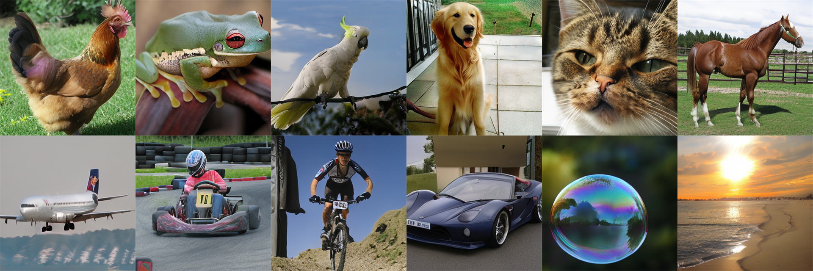
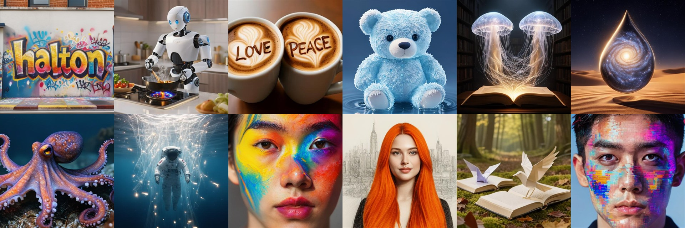

## 🌟 BIGFix: Bidirectional Image Generation with Token Fixing 🌟

[](https://github.com/valeoai/BigFix/stargazers)
[](https://huggingface.co/llvictorll/BigFIX/tree/main)
[](https://colab.research.google.com/github/valeoai/BigFix/blob/main/demo_txt2img.ipynb)
[](LICENSE.txt)
[](https://arxiv.org/abs/2510.12231)
[](https://openreview.net/forum?id=RDVrlWAb7K) 

Official PyTorch implementation of:  
**BIGFix: Bidirectional Image Generation with Token Fixing**  
*Victor Besnier, David Hurych, Andrei Bursuc, Eduardo Valle*  
arXiv:2510.12231

TL;DR: Parallel (masked-token) generation is fast but, unlike autoregressive decoding, it can't revisit a token
once committed -- so early sampling mistakes get "baked in" and corrupt the rest of the generation. BIGFix trains
the model to expect this by injecting random/self-sampled tokens into the visible context (`p_resample` /
`bigfix/utils/masking_scheduler.py`), so it learns to fix errors it (or an earlier step) already committed instead of
blindly trusting them. This preserves the speed of parallel decoding while closing much of the quality gap with
slower, error-correcting samplers -- on top of it, the Halton Scheduler spreads which tokens get decoded at each
step uniformly across the image, further reducing sampling errors. The paper reports substantial gains from this
combination on image generation with up to an order-of-magnitude inference speedup from
multi-token parallel prediction.

---

## 🚀 Overview

Welcome to the official implementation of BIGFix ! 🎉

This repository includes:
1. **Class-to-Image Model**: Generates high-quality 384x384 images from ImageNet class labels.

<p align="center">
  
</p>

2. **Text-to-Image Model**: Generates realistic images from textual descriptions, up to 512x512
   (see `bigfix/txt2img_pipeline.py` for a minimal inference example, and the
   [BigFIX xlarge/512 checkpoint](https://huggingface.co/llvictorll/BigFIX) on Hugging Face).
<p align="center">
  
</p>

Both models share the same self-correcting training recipe (`p_resample` in `bigfix/utils/masking_scheduler.py`) and the
Halton sampling schedule at inference time.

Explore, train, and extend our easy to use generative models! 🚀

The v1.0 version, previously known as "MaskGIT-pytorch" is available [here!](https://github.com/valeoai/BigFix/releases/tag/v1.0)

---

## 📁 Repository Structure

```plaintext
├ BigFix/
|    ├── bigfix/                                <- The installable Python package (`import bigfix`)
|    |    ├── config/                           <- Base config files (package data)
|    |    |      ├── base_cls2img.yaml
|    |    |      ├── base_txt2img.yaml
|    |    |      └── xlarge_txt2img_gpic.yaml
|    |    ├── dataset/                          <- Data loading utilities
|    |    |      ├── dataset.py                 <- PyTorch dataset class
|    |    |      └── dataloader.py              <- PyTorch dataloader
|    |    ├── metrics/
|    |    |      ├── inception_metrics.py       <- Inception score and FID evaluation
|    |    |      ├── sample_and_eval.py         <- Sampling and evaluation
|    |    |      └── *.tsv                      <- Evaluation prompts
|    |    ├── network/
|    |    |      ├── ema.py                     <- EMA model
|    |    |      ├── transformer.py             <- Transformer for class-to-image
|    |    |      ├── txt_transformer.py         <- Transformer for text-to-image
|    |    |      └── vq_model.py                <- VQGAN architecture
|    |    ├── sampler/
|    |    |      ├── confidence_sampler.py      <- Confidence scheduler
|    |    |      └── halton_sampler.py          <- Halton scheduler
|    |    ├── trainer/                          <- Training classes
|    |    |      ├── abstract_trainer.py        <- Abstract trainer
|    |    |      ├── cls_trainer.py             <- Class-to-image trainer
|    |    |      └── txt_trainer.py             <- Text-to-image trainer
|    |    ├── utils/
|    |    |      ├── masking_scheduler.py       <- BIGFix's masking + token-fixing/self-correction training recipe
|    |    |      └── rewards.py                 <- Optional reward models (CLIP, PickScore, ImageReward, HPSv2, ...)
|    |    ├── main.py                           <- Training / evaluation entry point (`python -m bigfix.main`)
|    |    └── txt2img_pipeline.py               <- Minimal, diffusers-style text-to-image inference wrapper
|    ├── scripts/                               <- Data preparation (run once before training)
|    |      ├── extract_vq_features.py          <- Pre-extract the VQGAN codes of ImageNet
|    |      ├── extract_vq_txt_features.py      <- Extract VQGAN codes + text embeddings from text-image WebDataset shards
|    |      └── extract_train_fid.py            <- Precompute FID stats for ImageNet
|    ├── launch/
|    |      ├── run_c2i_{base,xlarge}.sh        <- Training scripts for class-to-image
|    |      └── run_t2i_{base,xlarge}.sh        <- Training scripts for text-to-image
|    ├── statics/                               <- Sample images and assets
|    ├── saved_networks/                        <- placeholder for the downloaded models
|    ├── demo_txt2img.ipynb                     <- Text-to-image inference demo (Jupyter / Colab)
|    ├── LICENSE.txt                            <- MIT license
|    ├── THIRD_PARTY_NOTICES.md                 <- Licenses of the third-party code and data used here
|    ├── pyproject.toml                         <- Package metadata and dependencies
|    └── README.md                              <- This file! 📖
```

## 🛠️ Usage
Get started with just a few steps:

### 1️⃣ Clone the repository

   ```bash
   git clone https://github.com/valeoai/BigFix.git
   cd BigFix
   ```

### 2️⃣ Install dependencies

   ```bash
   conda create -n bigfix python=3.10 -y
   conda activate bigfix
   pip install -e .
   ```

   This installs the `bigfix` package (`import bigfix`), including its YAML configs, so it can be used from any
   working directory. The reward models (`bigfix/utils/rewards.py`) used for reward-conditioned text-to-image
   training and the RL fine-tuning are optional: `pip install -e ".[reward]"`.

### 3️⃣ Train the model

Both examples below train with BIGFix's token-fixing recipe (`--p-resample 0.2`) and the Halton sampler for the
periodic visualizations. Adapt the paths, `--global-bsize` and `--grad-cum` to your hardware. Single node shown;
ready-to-edit versions are in `launch/` (`run_c2i_*.sh`, `run_t2i_*.sh`). The training entry point is the module
`bigfix.main`, so it is started with `python -m bigfix.main` (or `torchrun ... -m bigfix.main` for several GPUs).

#### 🖼️ ImageNet (class-to-image, 384x384)

Download the pretrained [VQGAN](https://huggingface.co/FoundationVision/LlamaGen/blob/main/vq_ds16_c2i.pt), then
pre-extract the VQGAN codes of ImageNet once (the transformer is trained on the codes, not on the pixels):

   ```bash
   python scripts/extract_vq_features.py --data-folder="/path/to/ImageNet/" --dest-folder="/path/to/ImageNet_codes/" \
       --vqgan-folder="/path/to/vq_ds16_c2i.pt" --bsize=256 --f-factor 16 --img-size 384 --compile
   ```

Train (`--data-folder` must contain the `Train/` and `Eval/` folders written above):

   ```bash
   torchrun --standalone --nnodes=1 --nproc_per_node=gpu -m bigfix.main \
       --mode "cls-to-img" --data "imagenet_feat" --nb-class 1000 \
       --data-folder "/path/to/ImageNet_codes/" --vqgan-folder "/path/to/vq_ds16_c2i.pt" \
       --vit-folder "/path/to/saved_networks/imagenet_large/" --writer-log "/path/to/logs/imagenet_large/" \
       --vit-size "large" --img-size 384 --f-factor 16 --codebook-size 16384 --mask-value 16384 \
       --register 1 --proj 1 --dropout 0.1 --dtype "bfloat16" \
       --global-bsize 256 --lr 1e-4 --warm-up 2500 --max-iter 1000000 --grad-clip 1 \
       --p-resample 0.2 --resample-method shuffle \
       --sampler "halton" --sched-mode "arccos" --step 32 --cfg-w 1.5 \
       --resume --compile
   ```

#### 🎨 GPIC (text-to-image)

The text-to-image model reads [WebDataset](https://github.com/webdataset/webdataset) shards directly: images
(`jpg`/`png`/`webp`) and their captions (`txt`), no pre-extraction needed. Put the GPIC shards in
`/path/to/GPIC/train/*.tar`. Download the pretrained
[VQGAN](https://huggingface.co/llvictorll/BigFIX/blob/main/vq_ds16_t2i.pt) beforehand; the text encoder
(`google/flan-t5-xl`) is fetched from Hugging Face on first use.

   ```bash
   torchrun --standalone --nnodes=1 --nproc_per_node=gpu -m bigfix.main \
       --mode "txt-to-img" --data "gpic" --nb-class 3 \
       --data-folder "/path/to/GPIC/" --vqgan-folder "/path/to/vq_ds16_t2i.pt" \
       --vit-folder "/path/to/saved_networks/gpic_xlarge/" --writer-log "/path/to/logs/gpic_xlarge/" \
       --vit-size "xlarge" --img-size 256 --f-factor 16 --codebook-size 16384 --mask-value 16384 \
       --register 1 --proj 1 --dropout 0.0 --dtype "bfloat16" \
       --global-bsize 256 --grad-cum 2 --lr 1e-4 --warm-up 2500 --max-iter 200000 --grad-clip 1 \
       --p-resample 0.2 --resample-method shuffle \
       --sampler "halton" --sched-mode "arccos" --step 32 --cfg-w 5 --sm-temp 1.1 --top-p 0.8 \
       --resume
   ```

   To go up to 512x512, raise `--img-size 512`, lower `--global-bsize` (e.g. 16) and raise `--grad-cum`
   accordingly (see `launch/run_t2i_xlarge.sh`).


## 📟 Quick Start for sampling
To quickly verify the functionality of our model, you can try this Python code:

```python
from bigfix import MaskGITPipeline

# BigFIX text-to-image, 512x512, straight from Hugging Face
pipe = MaskGITPipeline.from_pretrained(
    repo_id="llvictorll/BigFIX",
    vit_filename="BigFix_XLarge_aplha02_res512_MiroFT.pth",
    vqgan_filename="vq_ds16_t2i.pt",
    config="xlarge_txt2img_gpic.yaml",  # one of the configs shipped in bigfix/config/, or a path to your own
    img_size=512,
).to("cuda")

image = pipe(
    prompt="A tiny astronaut hatching from an transparent egg on the moon.",
    num_inference_steps=32,
    guidance_scale=5.0,
    seed=42,
).images[0]

image.save("t2i_example.png")
```

🎨 Want to try the model, but you don't have a gpu? Check out the Colab Notebook for an easy-to-run demo! 
[](https://colab.research.google.com/github/valeoai/BigFix/blob/main/demo_txt2img.ipynb)

## 🧠 Pretrained Models
Class-to-image models are on [Hugging Face](https://huggingface.co/llvictorll/Halton-MaskGIT/tree/main), and the
BIGFix text-to-image model is on [Hugging Face](https://huggingface.co/llvictorll/BigFIX/tree/main).
Use them to jump straight into inference or fine-tuning.

| Model                | # Params | # Input | # GFLOP | VQGAN |  MaskGIT                                                          | 
|----------------------|----------|---------|---------|--------|-------------------------------------------------------------------|
| Halton-MaskGIT-Large | 480M     | 24x24   | 83.00   | [🔗 Download](https://huggingface.co/FoundationVision/LlamaGen/blob/main/vq_ds16_c2i.pt)   |  [🔗 Download](https://huggingface.co/llvictorll/Halton-MaskGIT/blob/main/ImageNet_384_large.pth)  | 
| BigFIX-XLarge (txt2img, 512x512) | -- | 32x32 | -- | [🔗 Download](https://huggingface.co/llvictorll/BigFIX/blob/main/vq_ds16_t2i.pt) | [🔗 Download](https://huggingface.co/llvictorll/BigFIX/blob/main/BigFix_XLarge_aplha02_res512_MiroFT.pth) |

## ❤️ Contribute
We welcome contributions and feedback! 🛠️
If you encounter any issues, have suggestions, or want to collaborate, feel free to:
 - Create an issue
 - Fork the repository and submit a pull request

Your input is highly valued. Let’s make this project even better together! 🙌

## 📜 License
This project is licensed under the MIT License.
See the [LICENSE](LICENSE.txt) file for details. Some code and data adapted from other projects remain under
their own licenses, listed in [THIRD_PARTY_NOTICES.md](THIRD_PARTY_NOTICES.md).

## 🙏 Acknowledgments
We are grateful for the support of the IT4I Karolina Cluster in the Czech Republic for powering our experiments.

The pretrained VQGAN ImageNet (f=16/8, 16384 codebook) is from the [LlamaGen official repository](https://github.com/FoundationVision/LlamaGen?tab=readme-ov-file)

## 📖 Citation
If you find our work useful, please cite us and add a star ⭐ to the repository :) 

BIGFix -- the token-fixing / self-correction training recipe (ArXiv), the main paper this repository now implements:
```
@article{besnier2025bigfix,
  title={BIGFix: Bidirectional Image Generation with Token Fixing},
  author={Besnier, Victor and Hurych, David and Bursuc, Andrei and Valle, Eduardo},
  journal={arXiv preprint arXiv:2510.12231},
  year={2025}
}
```

The Halton Scheduling (ICLR2025) -- the decoding schedule used at inference time:
```
@inproceedings{besnier2025iclr,
  title={Halton Scheduler for Masked Generative Image Transformer},
  author={Victor Besnier, Mickael Chen, David Hurych, Eduardo Valle, Matthieu Cord},
  booktitle={International Conference on Learning Representations (ICLR)},
  year={2025}
}
```

Or simply the code repository for reproduction of MaskGIT (ArXiv):
```
@article{besnier2023pytorch,
  title={A pytorch reproduction of masked generative image transformer},
  author={Besnier, Victor and Chen, Mickael},
  journal={arXiv preprint arXiv:2310.14400},
  year={2023}
}

```
